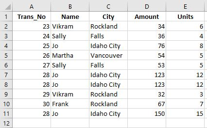
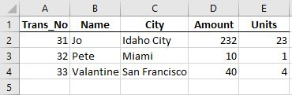
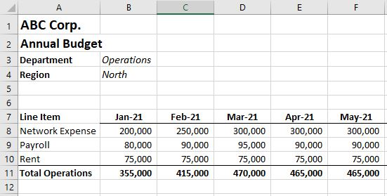

=====================
Get Started and Usage
=====================

Create an **fpa** Object
------------------------

Welcome to **pyfpa** [beta].  Let's get the data trapped in Excel Files into a central data cube to better analyze your data!

To use **pyfpa** in a project::

    from pyfpa import fpa

First step is to create an fpa object.  'f' has been chosen here (shorthand for financials), but you could call it anything (sales, budget, models, forecasts, etc.)

.. code-block::

    f = fpa()

This object will allow you to import, consolidate and slice data.  **pyfpa** is based around data objects (pandas DataFrames) which hold the data and the results of analysis.  The six primary data objects within f are f.data, f.block, f.slice, f.variance, f.consolidation, and f.function_result.  At this point they will all be empty.

The '.data' data object is the main repository for the data in the object while the '.block' data object is the landing pad for the basic import functions.  The others are used to capture the results of functions.

Quick Start Example - Getting Tables from Excel into the **fpa** Object
-----------------------------------------------------------------------
The goal of this example is to read two sales results tables from Excel into the the f.data data object. First we will load the tables into the f.block data object one at a time, change it if we need to, add it to the f.data object.

The first sales Excel file looks like:

To read this table into fpa we will use the **import_xl(fpath, ws_name=0, cols_to_index=0)** function.  This function will find the Excel file from the corresponding fpath, look at the worksheet in question (0 default is the first tab) and apply indexes to the specified columns (remember Python counting starts at zero).  For this first go round we will only provide the fpath and leave the rest as the defaults.

.. code-block::

	f.import_xl(r'c:\ABC_Corp\sales\sales1.xlsx')
	
[Here we used the r in front of the fpath string because the backward slashes in the path we copied will interfer with Python.  You can either use a the r in front of the string or change the '\' to '/'.]

The table has now been imported to the f.block data object.

.. code-block::

	f.block
	
The table has been given a Data_Block id (so it can be traced to the file where it came from and when it was uploaded) and has the dimension "Trans_No" which was the first column in the table (selected by the cols_to_index default of zero).

Now we could add the table to the main f.data repository, but we would like to take better advantage of the dimension slicing.  We are going to move the "Name" and "City" columns to the dimensions (or index).

.. code-block::

	f.move_col_to_dims(['Name', 'City'], 'block')
	
For the **move_col_to_dims(dims, data_obj='data')** we have provided a list of of columns to move into the dimensions and identified the 'block' data object as the default value is the 'data' object.  For most functions the default data object is 'data'.

Now we add the f.block to f.data.

.. code-block::

	f.add_block_to_data()
	
You will notice this function (also called a method and has () at the end) has no inputs as it does a very specific task.  And now the transformed f.block is in f.data.

.. code-block::

	f.data
	
Calling f.data (you see it has no () at the end as its a field or attribute) shows the sales data.

That is the first sales report, but now its a new week and we want to add the new sales report to f.data.

The new sales report looks like:

We read the new report into f.block, but this time we want to add the 'Name' and 'City' columns directly.  We can do this by using the *cols_to_index* input in **import_xl**.

.. code-block::

	f.import_xl('c:/ABC_Corp/sales/sales2.xlsx', cols_to_index=[0, 1, 2)])
	
A few things to notice.  We put the name of the input (*cols_to_index*) directly in the function as we skiped over the *ws_name* input.  If you go out of order putting in the inputs you have the add the input label plus "=".  The inputs for the function could also have been *('c:/ABC_Corp/sales2.xlsx', 0, [0, 1, 2)])* as we included the *ws_name* so the positional order was not broken.  Also, we changed used forward slashes '/' in the *fpath* so we do not need the 'r' in front of the sting.

The block has the dimensions we want.

.. code-block::

	f.block

Append the f.block with the new sales results to f.data.

.. code-block::

	f.add_block_to_data()
	
The 'data' object now has both sales results reports in it.

.. code-block::

	f.data
	
Now that we have the data we can slice and dice based on dimensions to get.  For this example lets say we want to get all 'Unit' sales for 'Idaho City' and 'Rockland'.

We will use the **slice_data(dims=None,   dim_values=None,   col_range=None,   col_list=None,   data_obj='data',   append_to=False)** function.  Using the *dims*, *dim_values*, and *col_list* inputs, we will choose the 'City' dimension, look for 'Idaho City' and 'Rockland' in the dim_values, and take the 'Unit' column.

.. code-block::

	f.slice_data(['City'], [['Idaho City', 'Rockland']], col_list=['Units'])
	
Important items to note here:  

		- If there is more that one, the input values have to be entered as a list (in Python a list is denoted by the square brackets '[]')
		- If you have more than one lookup value for a specific dim (dimension) all the values must also be in a list.
				- i.e. if the dimensions were ['Name', 'City'], the lookup values should be [['Jo', 'Vikram'], ['Idaho City', 'Rockland']] with each sub-list corresponding the dims.
				- If its just one lookup value you do not need the sublist.  i.e. If dims are ['Name', 'City'], the dim_values could be ['Jo', 'Idaho City']. Also f.slice_data('Name', 'Jo') will work.
		- Also, the slicing will work with columns not brought into the dimensions (index) though performance is better if you bring search dimensions into the dimensions (index).
	
The result of the slice is returned and resides in the f.slice data object.

.. code-block::

	f.slice
	
You can now 'to_clipboard()' to cut and paste into Excel.

.. code-block::

	f.slice.to_clipboard()
	
Or save the f.slice dataframe as an Excel file.

.. code-block::

	f.slice.to_excel('c:/ABC_Corp/sales/Sales_Slice_query1.xlsx')

To save the project give it a name and a path to a directory.

.. code-block::

	f.save_project('Sales_Cube', 'c:/ABC_Corp/sales')
	
This will create a new directory in the path you provided called 'Sales_Cube' (if it doesn't already exist) containing a few of the data objects of the project.

To retrieve this project at anytime in the future to add or update it, you can use 'load_project' and referencing the project's root directory.

.. code-block::

	f.load_project('c:/ABC_Corp/sales/Sales_Cube')
	
Now you have full access to the data in the project again.  You can add new sales reports as they come in and slice and dice as you need to.

Quick Start Example - Retrieving Data from Sub-Directories
----------------------------------------------------------
The goal of this example is to consolidate department budgets.  While we are using it for budgets, it can be used for any excel file data in different directories, such as sales reports, product orders, payments, etc.

During your budgeting process, your department budgets are kept in different folders under the main budget directory.  Each budget file is kept in the subdirectory like:

ABC_Corp/
	budgets/
		|-operations/
			- Annual_Operations_Budget_v1.xlsx
		|-purchasing/
			- Annual_Purchasing_Budget_v1.xlsx
		|-sales/
			- Annual_Sales_Budget_v1.xlsx

Each budget file looks similar to:

From each budget template we want to be able to tag this data with its corresponding Department and Region as well as indicate it is a Budget.

Here we can use the **import_custom_directories** function to read the budgets to the f.data object.  The structure of this function is below:

**import_xl_directories(dir_path,  xl_id,  ws_name,  table_coords,  idx_cols,  dim_names,  dim_vals,  dim_names_coords,  dim_coords,  fill_index_na)**

Each one of the inputs allows us to map the data we want to pull from the Excel file.  For a description of each of the inputs see :meth:`~pyfpa.pyfpa.import_xl_directories`.

The function will go to each subdirectory in dir_path and look for a file whose name contains 'Budget_v1' (the xl_id input).  In this case the python code looks like:

.. code-block::

	f.import_xl_directories('C:/ABC_Corp/budgets',
				   'Budget_v1', 0, ['a7', 'm10'], 0, ['Type'], ['Budget v1'], ['a3', 'a4'], ['b3', 'b4'])

The f.data now contains each one of the department budgets in a dataframe with dimensions (aka index), including Department, Region and Type.  Type the code below to see the data.

.. code-block::

	f.data
	
Using the meta data collected (stored in the f.meta_block data object), you can see where the data in a 'Data_Block' comes from and when it was loaded into the project.  Use the Data_Block id number (Data_Block Number) in the **get_block_info()** function.

.. code-block::

	f.get_block_info(Data_Block Number)

We can now consolidate the data based on the 'Line Item' dimension.

.. code-block::

	f.consol_dimension('Line Item')
	
The f.consolidation object now has the consolidated data from all three departments broken out by 'Line Item'.

You can now 'to_clipboard()' to cut and paste into Excel.

.. code-block::

	f.consolidation.to_clipboard()
	
Or save the f.consolidation dataframe as an Excel file.

.. code-block::

	f.consolidation.to_excel('c:/ABC_Corp/budgets/Expense Consolidation.xlsx')

To save the project give it a name and a path to a directory.

.. code-block::

	f.save_project('Budget_Cube', 'c:/ABC_Corp/budgets')
	
This will create a new directory in the path you provided called 'Budget_Cube' containing a few of the data objects of the project.

To retrieve this project at anytime in the future to add or update it, you can use 'load_project' and referencing the project's root directory.

.. code-block::

	f.load_project('c:/ABC_Corp/budgets/Budget_Cube')
	
Now you have full access to the data in the project again.  You can add different budget versions to the project to keep track of changes and then start adding Actuals once the year begins.
	

